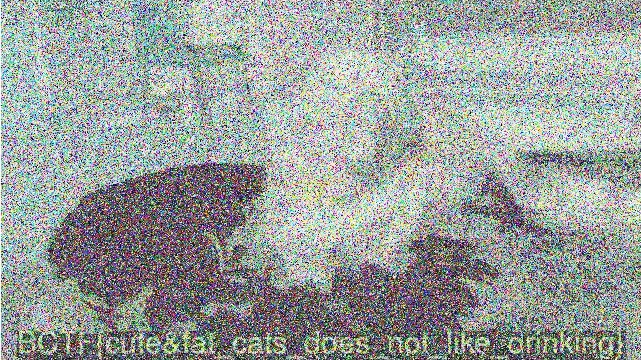

# Forensics 150: Cat Video

We are given an mp4 video of colorful static. You can see motion in the static as it plays, but it's not clear what it is.

My first thought was to average all of the frames together and see if the shapes were clear, but it didn't work.
Another common method of hiding something in an image/video is to xor it with a key, another image, etc. So I wrote up a 
Matlab script to xor the first half of the video together:
```
v = VideoReader('catvideo.avi');
n = v.NumberOfFrames;
d = read(v, 1);
for f=2:2:n/2
    i = read(v, f);
    d = bitxor(d,i);
end
imshow(d)
```

That didn't work out, but after playing with the numbers a bit I ended up trying a few different frames manually.
This is the result of xor(frame1, frame1000):
```
v = VideoReader('catvideo.avi');
n = v.NumberOfFrames;
d = read(v, 1);
d = bitxor(d, read(v, 1000));
imshow(d)
```



and that's the flag: BCTF{cute&fat_cats_does_not_like_drinking}
